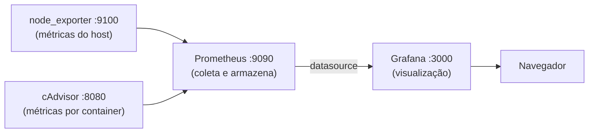

# NixOS: módulos e observabilidade (Prometheus + Grafana)

Documentação do processo de organizar a configuração em `~/nixos-config` como módulos separados, e da stack de monitoramento montada em cima do servidor de Minecraft. Repositório: https://github.com/Rozzzena/NixOS

## Pré-requisitos já resolvidos

- `git` configurado (`user.name`, `user.email`) e declarado permanentemente via módulo (não depende mais de `nix-shell -p git`)
- Repositório inicializado, branch `main`, remoto `origin` apontando pro GitHub
- Autenticação via Personal Access Token (classic, escopo `repo`, validade 90 dias) — `credential.helper store` configurado, não pede token a cada push
- Rebuild feito sempre com `sudo nixos-rebuild switch --flake .#nixos`, a partir da raiz do repositório

## O padrão de módulo

Qualquer arquivo `.nix` que devolve um conjunto de configurações é um módulo. Não existe mágica de nome de pasta — o que importa é a lista em `imports`, dentro de `configuration.nix`:

```nix
imports = [
  ./hardware-configuration.nix
  ./modules/power.nix
  ./modules/core-packages.nix
  ./modules/prometheus.nix
  ./modules/grafana.nix
];
```

Regra que já causou dois erros diferentes e vale lembrar: um arquivo só existe pro Nix se estiver **rastreado pelo git** (`git add`, nem precisa commitar) e **listado em `imports`**. Existir no disco não é suficiente pras duas coisas.

## Fluxo de trabalho padrão

```bash
cd ~/nixos-config
nano modules/nome-do-modulo.nix     # criar ou editar
nano configuration.nix              # garantir que está em imports

git add .
sudo nixos-rebuild switch --flake .#nixos   # testar antes de commitar de vez

git commit -m "mensagem descritiva"
git push
```

## Módulos

### `modules/power.nix`

Desativa suspensão do sistema. Foi criado depois de diagnosticar que o playit.gg caía porque a máquina entrava em suspensão via KDE (`systemd-logind: The system will suspend now!`), não por queda de energia.

```nix
{ ... }:
{
  systemd.targets.sleep.enable = false;
  systemd.targets.suspend.enable = false;
  systemd.targets.hibernate.enable = false;
  systemd.targets.hybrid-sleep.enable = false;
}
```

### `modules/core-packages.nix`

Pacotes de sistema declarados globalmente — hoje só o `git`.

```nix
{ pkgs, ... }:
{
  environment.systemPackages = with pkgs; [
    git
  ];
}
```

### `modules/prometheus.nix`

Prometheus mais dois coletores: `node_exporter` (métricas da máquina inteira) e `cAdvisor` (métricas por container Docker, incluindo o do Minecraft).

```nix
{ config, ... }:
{
  services.prometheus = {
    enable = true;
    port = 9090;

    exporters.node = {
      enable = true;
      port = 9100;
      enabledCollectors = [ "systemd" ];
    };

    scrapeConfigs = [
      {
        job_name = "node";
        static_configs = [{ targets = [ "localhost:${toString config.services.prometheus.exporters.node.port}" ]; }];
      }
      {
        job_name = "cadvisor";
        static_configs = [{ targets = [ "localhost:${toString config.services.cadvisor.port}" ]; }];
      }
    ];
  };

  services.cadvisor = {
    enable = true;
    port = 8080;
  };
}
```

### `modules/grafana.nix`

Grafana com datasource do Prometheus provisionado automaticamente (sem clicar em nada na interface) e porta 3000 liberada no firewall.

```nix
{ config, pkgs, ... }:
{
  services.grafana = {
    enable = true;
    settings.server = {
      http_addr = "0.0.0.0";
      http_port = 3000;
    };
    settings.security.secret_key = "$__file{/var/lib/grafana/secret_key}";
    provision = {
      enable = true;
      datasources.settings.datasources = [
        {
          name = "Prometheus";
          type = "prometheus";
          url = "http://localhost:${toString config.services.prometheus.port}";
          isDefault = true;
        }
      ];
    };
  };

  systemd.services.grafana.preStart = ''
    test -f /var/lib/grafana/secret_key || ${pkgs.openssl}/bin/openssl rand -hex 32 > /var/lib/grafana/secret_key
    chmod 600 /var/lib/grafana/secret_key
  '';

  networking.firewall.allowedTCPPorts = [ 3000 ];
}
```

**Sobre o `secret_key`:** não fica escrito em lugar nenhum versionado. O `preStart` gera uma chave aleatória (`openssl rand -hex 32`) na primeira vez que o serviço sobe, salva em `/var/lib/grafana/secret_key` — fora do Nix store, que é mundialmente legível — e reaproveita a mesma chave nos restarts seguintes (o `test -f ... ||` evita gerar uma nova toda vez, o que invalidaria qualquer dado já criptografado com a anterior). O `configuration.nix`/`grafana.nix` só referencia o **caminho** do arquivo (`$__file{...}`), nunca o valor em si.

Se precisar consultar a chave localmente (por exemplo, pra migrar pra outra máquina preservando os mesmos datasources criptografados):

```bash
sudo cat /var/lib/grafana/secret_key
```

Esse valor não deve ser colado em nenhum arquivo do repositório.

## Arquitetura da observabilidade



Só a porta 3000 (Grafana) fica aberta no firewall pra rede local. Prometheus, node_exporter e cAdvisor continuam acessíveis apenas via `localhost`, já que só o Grafana e o próprio Prometheus precisam falar com eles.

## Verificação

```bash
# serviços no ar
systemctl status prometheus.service cadvisor.service prometheus-node-exporter.service grafana.service

# prometheus enxergando os dois alvos
curl -s http://localhost:9090/api/v1/targets | grep -o '"health":"[a-z]*"'

# grafana respondendo
curl -s http://localhost:3000/api/health

# secret_key foi gerada corretamente (não mostra o valor, só confirma que existe)
sudo test -f /var/lib/grafana/secret_key && echo "ok"
```

## Acessando o Grafana e importando dashboards

1. Abrir `http://<ip-do-servidor>:3000` — login inicial `admin`/`admin`, troca de senha obrigatória no primeiro acesso
2. Conferir em **Connections → Data sources** se "Prometheus" já aparece configurado
3. Em **Dashboards → New → Import**, importar por ID:
   - `1860` — Node Exporter Full (métricas da máquina)
   - `19792` — cadvisor dashboard (métricas por container)
4. Em cada import, selecionar "Prometheus" como datasource antes de confirmar

## Pendências / próximos passos

- **Dashboards não são declarativos**: foram importados pela interface, então vivem só no banco interno do Grafana — não sobrevivem a uma reinstalação do zero. Dá pra declarar via `services.grafana.provision.dashboards`, apontando pra arquivos `.json` versionados no repositório.
- **"Restore on AC Power Loss"**: configurado direto na BIOS, fora do NixOS — não é algo que o `flake.nix` consegue documentar ou reproduzir automaticamente. Vale registrado aqui como lembrete manual: se trocar a placa-mãe, precisa reconfigurar.
